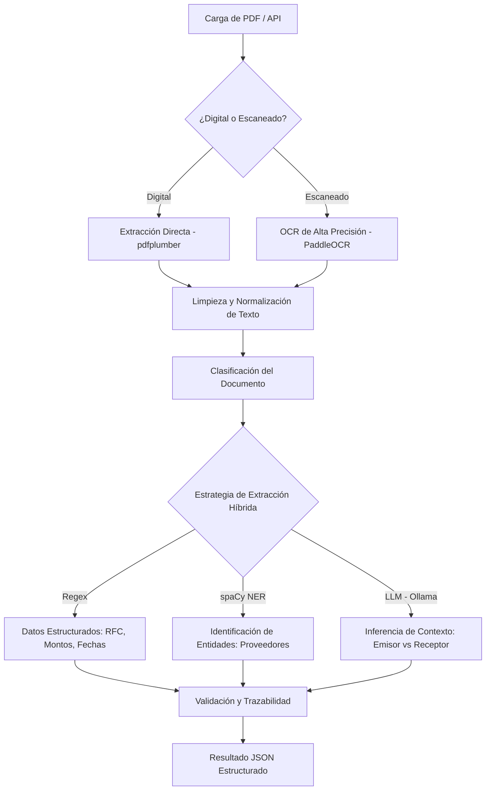

# Sistema de Extracción Inteligente de Datos

Este proyecto es un sistema avanzado para la extracción de información estructurada (RFC, montos, fechas, proveedores) de facturas y comprobantes en PDF. Utiliza una arquitectura híbrida que combina técnicas determinísticas con inteligencia artificial local.

## Funcionamiento del Sistema (Flujo de Datos)

El sistema procesa los documentos a través de una tubería (pipeline) de cinco etapas principales:



### 1. Entrada y Pre-procesamiento de Documentos
El sistema detecta automáticamente si el PDF contiene capas de texto (PDF Digital) o si es una imagen (PDF Escaneado).
- **PDF Digital**: Se extrae el texto directamente conservando la integridad de los caracteres.
- **PDF Escaneado**: Se procesa mediante **PaddleOCR**, optimizado para el idioma español, para convertir imágenes en texto legible.

### 2. Clasificación Inteligente
Una vez obtenido el texto, el sistema utiliza un modelo de Machine Learning entrenado (o un sistema de palabras clave como respaldo) para categorizar el documento en:
- **Factura** (CFDI)
- **Comprobante de Pago** (SPEI/Transferencia)
- **Recibo**

### 3. Extracción Híbrida de Información
Para garantizar la máxima precisión, el sistema emplea tres capas de extracción:
- **Capa Determinística (Regex)**: Utiliza expresiones regulares precisas para campos con formatos estándar como RFCs, fechas ISO y montos numéricos.
- **Capa de Lenguaje (spaCy NER)**: Procesa el lenguaje natural para identificar nombres de organizaciones y proveedores que no siguen un patrón fijo.
- **Capa de Inferencia (Ollama/LLM)**: En casos de ambigüedad (como distinguir entre el RFC del emisor y del receptor en una factura compleja), se consulta un modelo de lenguaje local (**Llama3** o **Mistral**) para comprender el contexto.

### 4. Validación y Trazabilidad
Cada dato extraído pasa por un proceso de validación (formatos de fecha, algoritmos de RFC, consistencia de montos). El sistema genera un reporte de **Trazabilidad**, indicando qué método extrajo cada campo (regex, spacy_ner, o llm), lo que permite auditar la confianza de los resultados.

### 5. Salida de Datos
El sistema entrega un objeto JSON estructurado, listo para ser integrado en sistemas contables o bases de datos.

---

## Requisitos Previos

- **Python 3.10+**
- **Ollama**: Descargar e instalar de [ollama.com](https://ollama.com).
  - Ejecutar `ollama pull llama3` antes de usar.
- **RAM**: Al menos 8GB (Recomendado 16GB).

## Instalación

1. Crear un entorno virtual:
   ```bash
   python -m venv env
   .\env\Scripts\activate  # Windows
   ```

2. Instalar dependencias:
   ```bash
   pip install -r requirements.txt
   ```

3. Descargar modelos de lenguaje:
   ```bash
   python -m spacy download es_core_news_sm
   ```

## Ejecución

Para iniciar la API:
```bash
uvicorn app.main:app --reload
```
La documentación interactiva estará disponible en: `http://localhost:8000/docs`.
